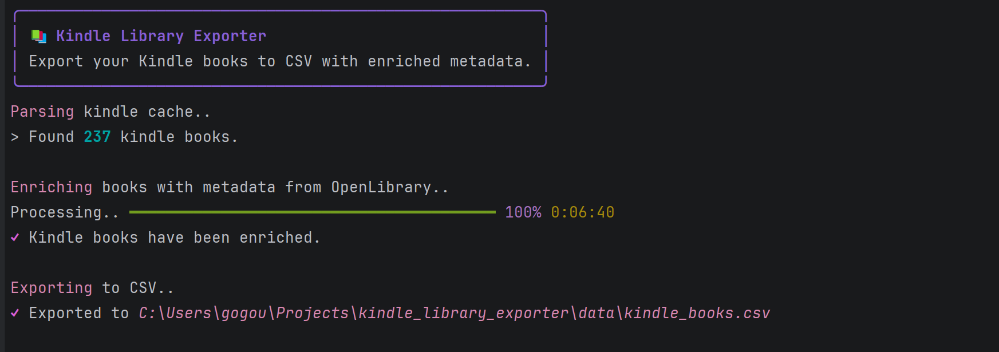

## 📚 Kindle Library Exporter
A python tool to export your Kindle Library from the local Kindle for PC cache file and enrich with metadata from OpenLibrary API.

### Features
* Extracts kindle books from Kindle for PC cache file.
* Enriches with metadata from OpenLibrary API.
* Export data to a CSV file for import to Notion or other platforms.
* Progress bar and information in terminal along with cancellation support.

### Demo



### Prerequisites
* Some recent Python version - *3.13 was used when making this*
* Cache file generated by the Kindle for PC app. 
> This file is .xml and it is generated after you sign in and sync in the Kindle for PC app from Amazon.

*You should not need to download any books for this to work within the Kindle for PC app.*

### Installation
1. **Clone the repository:**
```bash
   git clone https://github.com/yourusername/kindle-library-exporter.git
   cd kindle-library-exporter
```

2. **Create and activate virtual environment:**
   
*Windows (PowerShell):*
```powershell
   python -m venv venv
   venv\Scripts\Activate.ps1
```
   
*Mac/Linux:*
```bash
   python3 -m venv venv
   source venv/bin/activate
```

3. **Install dependencies:**
```bash
   pip install -r requirements.txt
```

### Usage
Run the exporter:
```bash
python src/main.py
```

After the tool is finished a csv file will be exported to: `data/kindle_books.csv`

### Interrupting
Cancel any time by pressing `Ctrl+C`.

### Example output

| Title   | Author       | Format | Genre | Page count |
|---------|--------------|--------|-------|------------|
| The Will of the Many | James Islington | Kindle | Fantasy | 720 |

### Notes
#### Missing genre or page count
OpenLibrary's API isn't complete with metadata for all books. This means sometimes there is no genre or page count information listed. In that case the columns will be empty and can be filled in manually by the user.

#### Rate limit
The tool includes a 0.5-second delay between requests to the API.
For my 237 kindle books it took about 6 minutes.

#### Genre standardization

The tool matches genres from the API's metadata to a curated list of genres for consistency.

Current genre options are: *Fantasy, Science Fiction, Mystery, Thriller, Horror, Romance, Historical Fiction, Literary Fiction, Young Adult, Biography, Self-help, Non-fiction*.

Genres not in the standard list are filtered out (e.g., "NYT Bestseller" tags).

#### Why Open Library API?

After some consideration and evaluation of different alternatives Open Library API seemed to be the best choice. More specifically:
* Google Books API:
  * Page count was not available in the metadata for any of the books.
  * Genre information was inconsistent or too broad.

* Web scraping (Amazon/Goodreads):
  * Violates TOS and could result in account suspension.
  * Goodreads used to have an API, although it seems to have been discontinued end of 2020.
  * Potential issues with bot detection for both.
  * Unreliable as it would depend on the website's structure.

Open Library API was the best option with:
* Good metadata coverage.
* Free and no API key requirement for authentication.
* Open source and safe for your amazon account.


